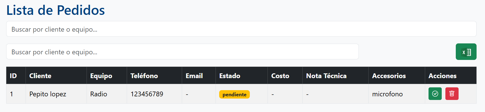
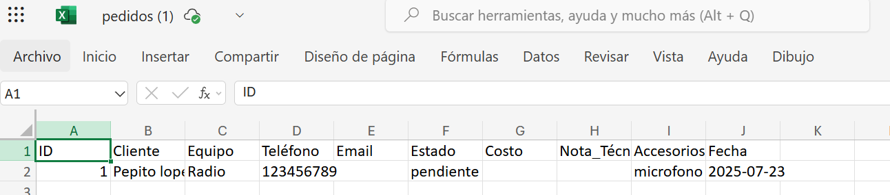

# Enlaces Comunicaciones - Sistema de Gestión de Reparaciones


**Sistema Web para registrar, consultar y administrar pedidos de reparación en el taller de Enlaces Comunicaciones.**

---

## 💻 Tecnologías Utilizadas

* **Frontend**: HTML + JavaScript + Bootstrap 5 + Bootstrap Icons
* **Backend**: Node.js con Express
* **Base de datos**: SQLite3 (local)
* **Exportación**: Exporta pedidos a Excel con SheetJS
* **PWA**: Progressive Web App con `manifest.json` y `favicon` compatible

---

## 🔄 Características

* Registro rápido de nuevos pedidos con validación
* Buscador en vivo por cliente o equipo
* Lista con tabla responsive y ordenada
* Estados: pendiente o reparado, editable con un botón
* Posibilidad de cargar costo estimado y nota técnica
* Alertas visuales y limpias por Bootstrap
* Exportación a Excel con un clic
* Iconos y diseño adaptado al logo y colores institucionales

---

## 🌐 Capturas recomendadas

Colocá estas 3 capturas en una carpeta `/screenshots` y luego referencialas en el README:

1. **Formulario de carga de pedido**
2. **Tabla con varios pedidos cargados**
3. **Descarga de Excel activa con SheetJS**

Agregalas así:


### Formulario de pedidos


### Tabla de pedidos cargados


### Exportación a Excel

```


## ⚡ Instalación y uso local

### 1. Clonar el repositorio

```bash
git clone https://github.com/MatiasLopezING/Reparaciones-EnlacesComunicaciones.git
cd Reparaciones-EnlacesComunicaciones
```

### 2. Instalar dependencias del backend

```bash
cd server
npm install
```

### 3. Crear base de datos local (se genera automáticamente al iniciar)

### 4. Ejecutar el servidor

```bash
node server.js
```

### 5. Acceder desde navegador

```
http://localhost:3000
```

---

## ✉ .gitignore

Este proyecto incluye un `.gitignore` para evitar subir:

* La base de datos (`/database/pedidos.db`)
* Archivos temporales y de sistema

---

## 📊 Estructura del Proyecto

```
mi-web-reparaciones/
├── public/           # Archivos frontend
├── server/           # Servidor Express
├── database/         # Contiene pedidos.db (ignorado)
├── manifest.json     # Configuración PWA
├── .gitignore
└── README.md
```

---

## 🚀 PWA Ready

Compatible con instalación en celulares Android desde navegador Chrome gracias al `manifest.json` y los `icons` configurados.

---

## ✍ Autor

**Matías López**
Ingeniería en Computación, UNLP
Proyecto personal para Enlaces Comunicaciones

---

> Si te sirvió este proyecto o querés contribuir, sentite libre de abrir un issue o forkearlo.
